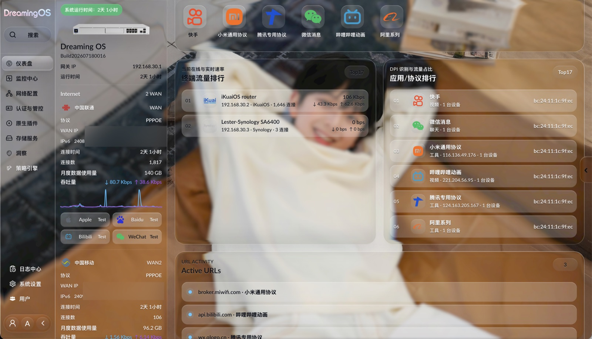

# 欢迎来到 DreamingOS

[English](README.en.md)

DreamingOS 是一个基于 OpenWrt 的路由器操作系统，致力于提供一致的管理体验、清晰可见的网络运行状态，以及适合现代家庭和小型网络的实用控制能力。

本项目基于 OpenWrt 官方源码树持续开发。DreamingOS 使用完整、独立的 `dreamingwrt-web` 管理界面，不依赖旧版 LuCI 应用或主题，并尝试让 Web 管理界面、控制服务、网络模型、系统更新和可选应用形成一套连贯的系统。

首个公开版本为 **26.07.1**。

> **特别注意**：`dev` 分支仅限开发者尝鲜使用，建议使用 PVE 或 ESXi 等虚拟机进行安装。测试版本可能出现不可预料的错误，请谨慎尝试！当前正在开发中，部分功能会逐步上线，请持续关注。

## 界面预览

以下截图来自开发中的 DreamingOS 控制台，最终界面以实际版本为准。





## 为什么做 DreamingOS

DreamingOS 起源于一个很直接的需求：路由器应该清楚地告诉用户它正在做什么，配置变更应该可以理解，日常网络管理也应该像在使用同一个完整产品，而不是在互不相干的页面和配置文件之间来回切换。

目前的开发方向包括：

- 统一的 DreamingOS Web 管理界面；
- 由 DreamingOS 控制服务提供的结构化系统与网络 API；
- Dashboard、终端、拓扑、线路健康、路由、日志、通知和系统管理；
- 事务化配置、能力声明、操作审计和故障恢复；
- 基于 x86_64、glibc 和较新 Linux 内核的开发基线；
- 后续逐步开放的原生应用与扩展能力。

以上后端能力不会全部包含在第一个公开版本中。`dreamingwrt-web` 会作为完整组件发布，不按页面拆分；暂未开放或依赖私有数据的能力会明确标记为不可用或降级，不发布空包或伪装成可用的占位功能。

## 当前状态

DreamingOS 仍在积极开发中。**26.07.1** 将是面向开发者和测试用户的早期源码版本。正式发布前，我们仍在确认首批软件包、依赖边界和受支持的安装方式。

早期版本中的接口、软件包边界和升级流程仍可能发生变化。每个版本会如实列出已经验证的能力和已知限制，不用笼统的“稳定”描述掩盖尚未完成的部分。

目前，DreamingOS 支持的 Linux 版本为 7.2（尚未发布正式版）。后续该内核版本会作为 `dev` 分支，持续跟进新版内核。

`stable` 分支计划使用 Linux 6.18 LTS。由于作者只有一个人，即使有 AI 加持，AI 也无法在完全脱离人类的情况下维护仓库，因此会有很多不足，敬请谅解（尤其是 `dev` 分支）。

由于 DreamingOS 使用了全新的 Web 服务，原来为 OpenWrt 主线适配的**全部** `luci-app-*` 都无法直接在 DreamingOS 的 Web 中运行。

后续版本计划引入 OpenWrt 兼容层，在独立端口中提供 OpenWrt 原生 Web 页面，相关更新正在筹备中。

### Web 访问端口

DreamingOS 的原生控制台与 OpenWrt 原生 Web 使用不同端口，互不影响：

- **OpenWrt 原生 Web（uhttpd / LuCI）**：`80` 端口。若系统中仍保留 OpenWrt 自带的 Web，可通过 `http://<设备IP>` 访问。
- **DreamingOS 控制台**：`12517` 端口，可通过 `http://<设备IP>:12517` 直接访问。同时 DreamingOS 也通过 `80` 端口的反向代理对外提供 `/app/`、`/login/` 等页面，因此从 `80` 端口进入时的 DreamingOS 路径不会与 LuCI 冲突。

默认登录地址为 `http://192.168.1.1:12517`，首次登录后请立即修改密码。

## 首批公开范围

首批公开版本以 OpenWrt 官方源码结构为基础。除了 `package/lester/` 下通过审计的 DreamingOS 组件，仓库也包含 Linux 7.2、glibc、网络服务和构建系统所需的补丁与兼容改动。

| 组件 | 作用 | 26.07.1 状态 |
| --- | --- | --- |
| OpenWrt 系统改动 | Linux 7.2-rc3、glibc 2.43、GCC 16 以及基础软件包兼容改动 | **包含** |
| JMX 内核补丁 | Conntrack 状态、流量控制、多 WAN 生命周期和 flow offload 隔离 | **包含** |
| PPP 与 IPv6 服务补丁 | PPPoE 多拨认证同步和静态 DHCPv6 IA-PD | **包含，IA-PD 仍属早期功能** |
| `dreamingwrt-web` | DreamingOS 完整、独立的原生管理界面 | **包含，按完整组件发布** |
| `jmxd` | 系统控制、API 和配套服务 | **包含；私有数据能力默认降级** |
| `jmx` | 网络和流量控制的内核侧集成 | **包含** |
| `libjmx_common` | JMX 组件使用的公共接口 | **包含** |
| `dreamingproxy` | 原生代理与出口策略应用 | **不包含在 26.07.1 中** |

`dreamingproxy` 的软件包源码不在本仓库中。`jmxd` 里仍保留它对应的服务槽位、
API 路由和权限定义，默认关闭；缺少该软件包时这些接口会返回不可用状态，不影响其余功能。

最终公开内容以仓库文件树和 [26.07.1 发布说明](CHANGELOG.md)为准。

## 不包含的内容

公开仓库不会附带私有或无权再分发的数据库、规则和库。首批版本尤其不会包含：

- 私有 DPI/应用特征库；
- 设备指纹库；
- 设备/品牌图库以及来源不明的 UniFi Setup 打包素材；
- 内部规则生成材料和数据处理资产；
- `dreamingproxy` 及其运行组件；
- 旧版 `luci-app-*`、`luci-theme-*` 以及历史 LuCI 后台；
- 未完成来源与许可证审计的第三方软件包。

公开组件必须能够在缺少这些私有资产时正常构建，并以明确方式关闭或降级相关能力，不能因为找不到私有文件而链接失败、启动崩溃或留下无法使用的页面。

## 构建

当前开发基线为 x86_64、glibc 2.43 和 Linux 7.2-rc3。`26.07.1` 是早期源码版本，完整固件构建仍需自行选择目标配置；默认不打包私有 DPI、指纹和图库数据。

## 注意

1. **不要用 root 用户进行编译**
2. 国内用户编译前最好准备好梯子
3. 默认登录地址为 `http://192.168.1.1:12517`，密码为 `password`；首次登录后请立即修改密码

## 编译命令

1. 首先装好 Linux 系统，推荐 Debian 或 Ubuntu LTS 24/26

2. 安装编译依赖

   ```bash
   sudo apt update -y
   sudo apt full-upgrade -y
   sudo apt install -y ack antlr3 asciidoc autoconf automake autopoint binutils bison build-essential \
   bzip2 ccache clang cmake cpio curl device-tree-compiler flex gawk gcc-multilib g++-multilib gettext \
   genisoimage git gperf haveged help2man intltool libc6-dev-i386 libelf-dev libfuse-dev libglib2.0-dev \
   libgmp3-dev libltdl-dev libmpc-dev libmpfr-dev libncurses5-dev libncursesw5-dev libpython3-dev \
   libreadline-dev libssl-dev libtool llvm lrzsz libnsl-dev ninja-build p7zip p7zip-full patch pkgconf \
   python3 python3-pyelftools python3-setuptools qemu-utils rsync scons squashfs-tools subversion \
   swig texinfo uglifyjs upx-ucl unzip vim wget xmlto xxd zlib1g-dev
   ```

3. 下载源代码，更新 feeds 并选择配置

   ```bash
   git clone https://github.com/Lester0504/DreamingOS.git
   cd DreamingOS
   ./scripts/feeds update -a
   ./scripts/feeds install -a
   make menuconfig
   ```

4. 下载 dl 库，编译固件
（-j 后面是线程数，第一次编译推荐用单线程）

   ```bash
   make download -j8
   make V=s -j1
   ```

你可以在各组件适用的许可证下自由使用。二次发布源码编译的固件时，希望你注明本仓库链接。
这是一个请求，不是许可证条款。谢谢合作！

二次编译：

```bash
cd DreamingOS
git pull
./scripts/feeds update -a
./scripts/feeds install -a
make defconfig
make download -j8
make V=s -j$(nproc)
```

如果需要重新配置：

```bash
rm -rf .config
make menuconfig
make V=s -j$(nproc)
```

编译完成后输出路径：bin/targets

### 使用 WSL/WSL2 进行编译

由于 WSL 的 PATH 中包含带有空格的 Windows 路径，有可能会导致编译失败，请在 `make` 前面加上：

```bash
PATH=/usr/local/sbin:/usr/local/bin:/usr/sbin:/usr/bin:/sbin:/bin
```

由于默认情况下，装载到 WSL 发行版的 NTFS 格式的驱动器将不区分大小写，因此大概率在 WSL/WSL2 的编译检查中会返回以下错误：

```txt
Build dependency: OpenWrt can only be built on a case-sensitive filesystem
```

一个比较简洁的解决方法是，在 `git clone` 前先创建 Repository 目录，并为其启用大小写敏感：

```powershell
# 以管理员身份打开终端
PS > fsutil.exe file setCaseSensitiveInfo <your_local_lede_path> enable
# 将本项目 git clone 到开启了大小写敏感的目录 <your_local_lede_path> 中
PS > git clone https://github.com/Lester0504/DreamingOS.git <your_local_dreamingos_path>
```

> 对已经 `git clone` 完成的项目目录执行 `fsutil.exe` 命令无法生效，大小写敏感只对新增的文件变更有效。

### macOS 原生系统进行编译

1. 在 AppStore 中安装 Xcode

2. 安装 Homebrew：

   ```bash
   /bin/bash -c "$(curl -fsSL https://raw.githubusercontent.com/Homebrew/install/HEAD/install.sh)"
   ```

3. 使用 Homebrew 安装工具链、依赖与基础软件包：

   ```bash
   brew unlink awk
   brew install coreutils diffutils findutils gawk gnu-getopt gnu-tar grep make ncurses pkg-config wget quilt xz
   brew install gcc@11
   ```

4. 然后输入以下命令，添加到系统环境变量中：

   - intel 芯片的 mac

   ```bash
   echo 'export PATH="/usr/local/opt/coreutils/libexec/gnubin:$PATH"' >> ~/.bashrc
   echo 'export PATH="/usr/local/opt/findutils/libexec/gnubin:$PATH"' >> ~/.bashrc
   echo 'export PATH="/usr/local/opt/gnu-getopt/bin:$PATH"' >> ~/.bashrc
   echo 'export PATH="/usr/local/opt/gnu-tar/libexec/gnubin:$PATH"' >> ~/.bashrc
   echo 'export PATH="/usr/local/opt/grep/libexec/gnubin:$PATH"' >> ~/.bashrc
   echo 'export PATH="/usr/local/opt/gnu-sed/libexec/gnubin:$PATH"' >> ~/.bashrc
   echo 'export PATH="/usr/local/opt/make/libexec/gnubin:$PATH"' >> ~/.bashrc
   ```

   - apple 芯片的 mac

   ```zsh
   echo 'export PATH="/opt/homebrew/opt/coreutils/libexec/gnubin:$PATH"' >> ~/.bashrc
   echo 'export PATH="/opt/homebrew/opt/findutils/libexec/gnubin:$PATH"' >> ~/.bashrc
   echo 'export PATH="/opt/homebrew/opt/gnu-getopt/bin:$PATH"' >> ~/.bashrc
   echo 'export PATH="/opt/homebrew/opt/gnu-tar/libexec/gnubin:$PATH"' >> ~/.bashrc
   echo 'export PATH="/opt/homebrew/opt/grep/libexec/gnubin:$PATH"' >> ~/.bashrc
   echo 'export PATH="/opt/homebrew/opt/gnu-sed/libexec/gnubin:$PATH"' >> ~/.bashrc
   echo 'export PATH="/opt/homebrew/opt/make/libexec/gnubin:$PATH"' >> ~/.bashrc
   ```

5. 重新加载一下 shell 启动文件 `source ~/.bashrc`，然后输入 `bash` 进入 bash shell，就可以和 Linux 一样正常编译了

## 版本规则

DreamingOS 使用 `YY.MM.N` 作为公开版本号：

- `YY`：两位年份；
- `MM`：两位月份；
- `N`：当月发布序号。

例如，`26.07.1` 表示 2026 年 7 月发布的第一个版本。Git tag 使用 `v` 前缀，例如 `v26.07.1`。

## 参与项目

仓库公开后，欢迎提交真实、可复现的 Bug 报告和范围明确的 Pull Request。

提交问题时，请尽量提供受影响的版本、目标平台、复现步骤、已经移除密码等敏感信息的相关配置，以及错误附近的精简日志。

详细要求见 [CONTRIBUTING.md](CONTRIBUTING.md)。仓库同时提供 Bug、功能建议和 Pull Request 模板。

## 安全问题

请不要在公开 Issue 中提交凭据、私钥、完整配置备份、包含私人流量的抓包或其他敏感设备数据。安全问题请按 [SECURITY.md](SECURITY.md) 中的方式私密报告。

## 上游与致谢

DreamingOS 基于 [OpenWrt](https://openwrt.org/) 构建，也受益于 OpenWrt 社区及各个上游开源项目的长期工作。

感谢 [fanchmwrt/fanchmwrt](https://github.com/fanchmwrt/fanchmwrt)。DreamingOS 的部分 DPI 组件基于该仓库代码二次开发，相关派生文件保留了原作者声明。

DreamingOS 是独立项目，并非 OpenWrt 官方发行版。第三方声明和各组件原有许可证会随对应源码保留。

## 许可证

本仓库是多许可证源码树。OpenWrt 基线及各第三方组件继续适用各自的许可证，DreamingOS 自有组件的许可证在对应源码与软件包元数据中标明。详情见 [COPYING](COPYING) 和 [THIRD_PARTY_NOTICES.md](THIRD_PARTY_NOTICES.md)。

## 维护者的话

ChatGPT为本项目贡献了90%以上的代码，有bug请喷他（bushi）
DreamingOS的诞生，我想借助AI，将一个产品的研发耗时缩短95%以上，并尽可能保住它的质量，这是我的一个小的尝试
我想解决现有OpenWrt发行版的一些痛点，DreamingOS的前身是luci-theme-argon，我很喜欢这个主题，所以我进行了魔改，使用了液态玻璃，以及一些很花哨的效果
但，旧的luci页面的历史包袱真的太重了，这么适配会导致一些其他插件显示异常
于是，我开始制作DreamingOS……我完全抛弃了OpenWrt的传统web页面与交互方式，重构了整个后台，并写了相应的后端
有人曾经提出了质疑：路由器后台再怎么好看有什么用？你又不是用它的后台
我的答案是，DreamingOS，不止“好看”，每个人对“好看”的定义不同，我不奢望所有人都说它“好看”，但我想尽可能把一款交互、操作逻辑更舒适的路由器带给你
它集成了流控、DPI、审计，以及一个AI Agent……我希望可以尽可能拉低你玩路由器的门槛
同时，对应IOS的App也在制作中，待时机成熟后会一同在本人的仓库中开源
这是一款真正的“AI路由器”，我也在筹备将一些更多好玩的东西带给你
（其实本项目有彩蛋，但我猜没人能找到它）
最后，出于某些原因，完整的DPI库以及设备指纹库并不会在前几个版本中与大家见面，但对应的代码会开放
Enjoy！
